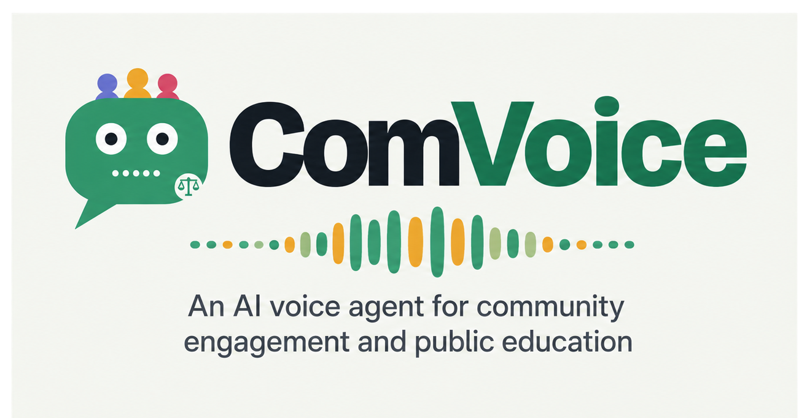

# ComVoice — Verified Legal Document RAG (Groq Starter)

ComVoice is a starter Retrieval-Augmented Generation (RAG) chatbot for legal/council documents.

<p align="center">
  
</p>

# ComVoice

**An AI voice agent for community engagement and public education**

ComVoice is an evidence-first Retrieval-Augmented Generation (RAG) system designed to make complex legal, planning and council documents easier for communities to understand.

## Features
- Upload PDF, DOCX, or TXT
- Page-aware PDF extraction
- Structure-aware-ish chunking
- Local sentence-transformer embeddings
- FAISS semantic search
- BM25 lexical search
- Hybrid retrieval
- Groq answer generation
- Exact quote verification
- Number/date verification
- Basic independent verifier call
- Abstains when evidence cannot be verified
- Streamlit UI

## 1. Create environment

Python 3.11+ recommended.

```bash
python -m venv .venv
```

Windows PowerShell:

```powershell
.venv\Scripts\Activate.ps1
```

macOS/Linux:

```bash
source .venv/bin/activate
```

## 2. Install

```bash
pip install -r requirements.txt
```

## 3. Add your Groq key

Copy `.env.example` to `.env`:

```env
GROQ_API_KEY=your_groq_api_key_here
GROQ_MODEL=openai/gpt-oss-120b
```

Never upload `.env` to GitHub.

## 4. Run

```bash
streamlit run app.py
```

Then open the local Streamlit URL shown in the terminal.

## How ComVoice answers

1. Extract document text with page metadata.
2. Chunk text while keeping source/page information.
3. Build local embeddings and a BM25 index.
4. Retrieve candidates with semantic + keyword search.
5. Fuse and rerank candidates.
6. Ask Groq to answer ONLY from retrieved evidence.
7. Require structured JSON with an answer and evidence claims.
8. Verify each quote against the actual extracted page text.
9. Verify numbers/dates in each claim occur in its cited page.
10. Ask a second verifier call whether each claim is supported.
11. If verification fails, ComVoice abstains.

## Important

This starter is an engineering prototype, not legal advice and not yet production hardened.
For scanned PDFs, add OCR before relying on extracted text.
